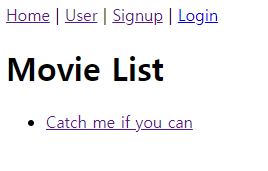
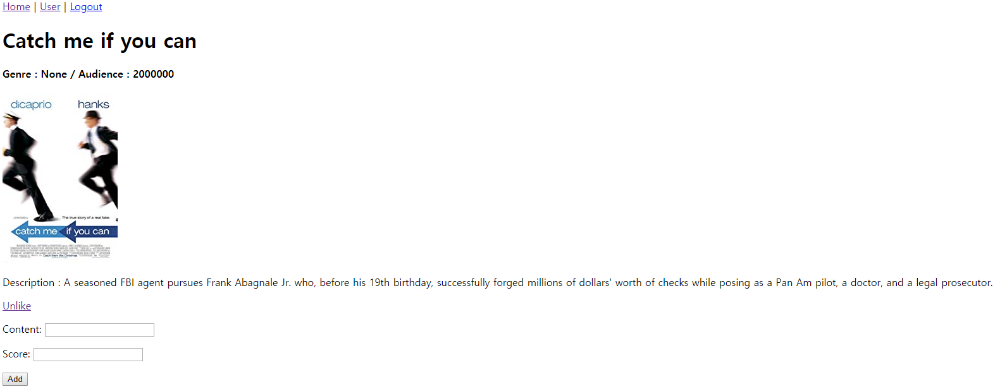
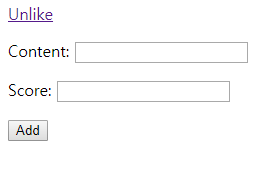
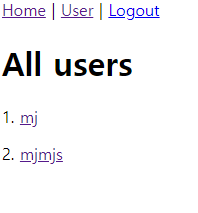
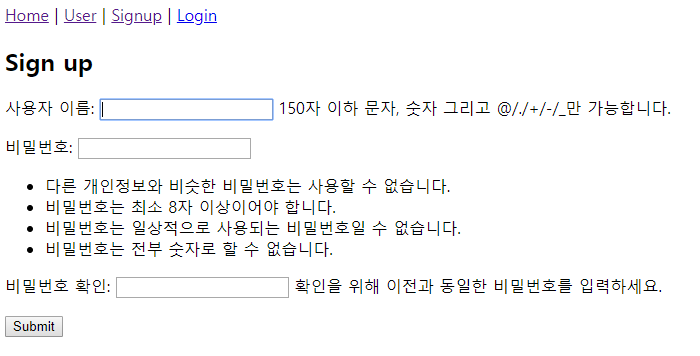
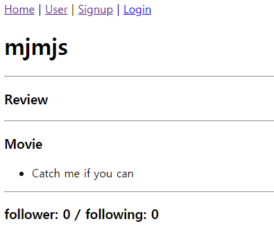

# Github Flow Practice with Movie info, like function

목적: 협업을 통한 데이터베이스 모델링 및 기능 구현

가장 처음에 가상환경 설정, 깃허브와 프로젝트 폴더 연결!

## 1. seed data 생성

처음에 movie와 review정보 입력을 위한 seed data생성을 위해 movies에서 movie, review form을 생성했다.

```python
from django.db import models
from django.conf import settings
# Create your models here.
class Genre(models.Model):
    name = models.CharField(max_length=20)

class Movie(models.Model):
    title = models.CharField(max_length=30)
    audience = models.IntegerField()
    poster_url = models.CharField(max_length=140)
    description = models.TextField()
    # 중계모델은 다대다 관계에서만 설정 가능
    genres = models.ManyToManyField(Genre, related_name='movies')
    # 영화와 유저 간 m:n 좋아요
    liked_users = models.ManyToManyField(settings.AUTH_USER_MODEL, related_name='liked_users')

class Review(models.Model):
    content = models.CharField(max_length=140)
    score = models.IntegerField()
    # 누가 어떤 영화에 댓글을 달았는지 알기 위해서
    user = models.ForeignKey(settings.AUTH_USER_MODEL, related_name='reviews', on_delete=models.CASCADE)
    movie = models.ForeignKey(Movie, related_name='reviews', on_delete=models.CASCADE)
    
```

accounts에서도 CustomUserCreationForm 생성

```python
from django.contrib.auth.forms import UserCreationForm
from django.contrib.auth import get_user_model

class CustomUserCreationForm(UserCreationForm):
    class Meta:
        model = get_user_model()
        fields = UserCreationForm.Meta.fields
```

admin페이지에서 편하게 보기 위해 admin.py 설정

```python
from django.contrib import admin
from .models import Genre, Movie, Review 
# Register your models here.
admin.site.register(Genre)
admin.site.register(Movie)
admin.site.register(Review)
```


## 2. 영화 정보 앱 설정

urls.py

```python
from django.urls import path
from . import views

app_name = 'movies'
urlpatterns = [
    path('', views.movielist, name='index'),
    path('detail/<int:movie_pk>/', views.moviedetail, name='moviedetail'),
    path('<int:movie_pk>/reviews_create', views.reviews_create, name='create'),
    path('<int:movie_pk>/reviews_delete/<int:review_pk>', views.reviews_delete, name='delete'),
    path('<int:movie_pk>/like', views.like, name='like'),
]
```

views.py

```python
from django.shortcuts import render, get_object_or_404, redirect
from .models import Movie, Review, Genre
from .forms import ReviewForm
from django.contrib.auth.decorators import login_required

def movielist(request):
    movies = Movie.objects.all()
    return render(request, 'movies/index.html', {'movies':movies})


def moviedetail(request, movie_pk):
    movie = get_object_or_404(Movie, pk=movie_pk)
    form = ReviewForm()
    context = {'movie': movie, 'form': form}
    return render(request, 'movies/detail.html', context)


@login_required
def reviews_create(request, movie_pk):
    if request.method == 'POST':
        form = ReviewForm(request.POST)
        if form.is_valid():
            review = form.save(commit=False)
            review.user = request.user
            review.movie_id = movie_pk
            review.save()
            return redirect('movies:moviedetail', movie_pk)
    else:
        form = ReviewForm()
    return redirect('movies:moviedetail', movie_pk)


@login_required
def reviews_delete(request, movie_pk, review_pk):
    review = get_object_or_404(Review, pk=review_pk)
    if review.user == request.user:
        review.delete()
    return redirect('movies:moviedetail', movie_pk)


@login_required  
def like(request, movie_pk):
    user = request.user
    movie = get_object_or_404(Movie, pk=movie_pk)
    if user in movie.liked_users.all():
        movie.liked_users.remove(user)
    else:
        movie.liked_users.add(user)
    return redirect('movies:moviedetail', movie_pk)

```


### movie list를 보여주는 첫 페이지



```django

 Movie List



<h1>Movie List</h1>

 <a href="">Create</a> 

<ul>
  
  <li>
    <a href="">{{ movie.title }}</a>

  </li>
  

</ul>


```

### 한 영화의 정보를 보여주는  moviedetail  페이지



```django



Movie Detail




<h1>  {{ movie.title }}</h1>

<h4>Genre : {{ movie.genres.name }} / Audience : {{ movie.audience }}</h4>

<p>Description : {{ movie.description }}</p>
<div>
  
    <a href="">Unlike</a>
  
    <a href="">Like</a>
  
</div>


<form action="" method="post">
  
  {{ form.as_p }}
  <button type="submit">Add</button>
</form>

<ul>

  <li>
    {{ review.score }} | {{ review.content }}
    
      <form action="" method="post">
        
        <button type="submit">Delete</button>  
      </form>
    
  </li>

</ul>

```

### 댓글을 달고 삭제하는 함수, like를 누르는 함수를 구현했다.

### 

movies - views.py

```python
from django.shortcuts import render, get_object_or_404, redirect
from .models import Movie, Review, Genre
from .forms import ReviewForm
from django.contrib.auth.decorators import login_required

def movielist(request):
    movies = Movie.objects.all()
    return render(request, 'movies/index.html', {'movies':movies})


def moviedetail(request, movie_pk):
    movie = get_object_or_404(Movie, pk=movie_pk)
    form = ReviewForm()
    context = {'movie': movie, 'form': form}
    return render(request, 'movies/detail.html', context)


@login_required
def reviews_create(request, movie_pk):
    if request.method == 'POST':
        form = ReviewForm(request.POST)
        if form.is_valid():
            review = form.save(commit=False)
            review.user = request.user
            review.movie_id = movie_pk
            review.save()
            return redirect('movies:moviedetail', movie_pk)
    else:
        form = ReviewForm()
    return redirect('movies:moviedetail', movie_pk)


@login_required
def reviews_delete(request, movie_pk, review_pk):
    review = get_object_or_404(Review, pk=review_pk)
    if review.user == request.user:
        review.delete()
    return redirect('movies:moviedetail', movie_pk)


@login_required
def like(request, movie_pk):
    user = request.user
    movie = get_object_or_404(Movie, pk=movie_pk)
    if user in movie.liked_users.all():
        movie.liked_users.remove(user)
    else:
        movie.liked_users.add(user)
    return redirect('movies:moviedetail', movie_pk)
```


## 3. Accounts 정보 앱 설정

유저 회원가입과 로그인, 로그아웃 기능을 구현해야 합니다.

### 모든 유저정보 보여주는 페이지



```django



User



<h1>All users</h1>

  <p>{{ user.pk }}. <a href="">{{ user.username }}</a></p>


```

### 유저 생성 폼.py



```django



Form




<h2>Sign up</h2>

<h2>Login</h2>

<form method="post">
  
  {{ form.as_p }}
  <button type="submit">Submit</button>
</form>

```

### 유저 정보에 대한 디테일 페이지



```django



User Detail



<h1>{{ user.username }}</h1>
<hr>
<h3>Review</h3>
<ul>
  
    <li>{{ review.content }}</li>
  
</ul>
<hr>
<h3>Movie</h3>
<ul>
  
    <li>{{ movie.title }}</li>
  
</ul>
<hr>

<h3>follower: {{ user.followers|length }} / following: {{ user.followings|length }} </h3>



```


### accounts의 views.py

```python
from django.shortcuts import render, get_object_or_404, redirect
from django.contrib.auth import get_user_model
from django.contrib.auth import login as auth_login, logout as auth_logout
from .forms import CustomUserCreationForm
from django.contrib.auth.forms import AuthenticationForm

def idx(request):
    users = get_user_model().objects.all()
    context = {'users': users}
    return render(request, 'accounts/index.html', context)


def detail(request, user_pk):
    user = get_object_or_404(get_user_model(), pk=user_pk)
    context = {'user': user}
    return render(request, 'accounts/detail.html', context)


def signup(request):
    if request.user.is_authenticated:
        return redirect('movies:index')
    if request.method == 'POST':
        form = CustomUserCreationForm(request.POST)
        if form.is_valid():
            user = form.save()
            auth_login(request, user)
            return redirect('movies:index')
    else:
        form = CustomUserCreationForm()
    context = {'form': form}
    return render(request, 'accounts/form.html', context)


def login(request):
    if request.user.is_authenticated:
        return redirect('movies:index')
    if request.method == 'POST':
        form = AuthenticationForm(request, request.POST)
        if form.is_valid():
            auth_login(request, form.get_user())
            next_page = request.GET.get('next')
            return redirect(next_page or 'movies:index')
        pass
    else:
        form = AuthenticationForm()
    context = {'form': form}
    return render(request, 'accounts/form.html', context)


def logout(request):
    auth_logout(request)
    return redirect('movies:index')

```


## 4. 느낀점

```
민주
- 지금까지 배운 모든 것을 복습할 수 있어서 좋았다.
- 영화 url을 넣는데 조금 어려움을 겪었지만 pjt7을 참고해 완료할 수 있었다.
- 짝인 현화가 많은 코드를 기억하는 것이 인상깊었다.
- github로 협업하는 새로운 방법을 배웠다. (fork이용)
- 복붙 할 때에도 신중히 해야 한다는 것을 알게 되었다.
- 지금 보노보노 같은 퀄리티에서 final project에는 더 이쁘게 꾸미고 싶다는 생각이 들었다.


현화
- 오랜만에 django를 사용해서 웹을 만들어 코드를 구현하는 것에 어려움을 겪었다.
- 종합 프로젝트 이전에 전체적인 부분을 만들어 볼 수 있어서 좋았다.
- github 을 통해 협업하는 방법에 대해서 알  수 있었다.
- 좀 더 다양한 기능을 구현하고 싶다는 생각을 하게되었다.
```

